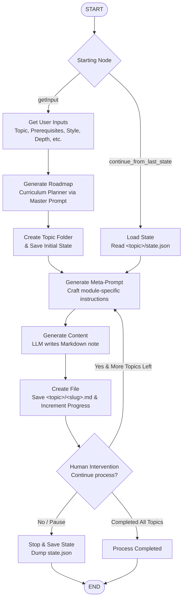

# 📚 Notes Maker — AI-Powered Knowledge Graph & Curriculum Generator

An intelligent, multi-agent study material and curriculum generation pipeline powered by **LangGraph**, **LangChain**, and high-performance LLMs (via Groq and OpenRouter). 

Instead of generating a monolithic block of text, **Notes Maker** treats a subject as a **non-linear knowledge graph**. It creates an interconnected web of structured Markdown notes featuring cross-links, visual diagrams, strict scope boundaries, and fully tailored pedagogical styles.

## 🚀 Key Features

- **Non-Linear Knowledge Graph Architecture**: Breaks down subjects into modular subtopics (`.md` files) with strict scope boundaries to prevent overlapping explanations, automatically cross-linking related modules using relative Markdown links (`[Topic](./other-topic.md)`).
- **Multi-Agent / Multi-Model Specialization**:
  - **Curriculum Architect** (`chatgpt` / `openai/gpt-oss-20b`): Generates structured JSON curriculum schemas and maps relational links.
  - **Meta-Prompt Engineer** (`meta` / `openai/gpt-oss-20b`): Dynamically constructs hyper-focused prompt instructions for each module.
  - **Content Generator** (`qwen` / `qwen/qwen3.8-27b`): Writes in-depth, rich Markdown notes adhering to pedagogical rules, tables, and Mermaid graphs.
- **Deep Pedagogical Customization**:
  - **Methodologies**: Standard Textbook, Cheat Sheet, Case-Study Driven, Visual/Structural Notes, Flashcard/Q&A, or "Like ChatGPT".
  - **Depth Levels**: Primer / Crash Course, Standard Foundation, Comprehensive Review, Advanced / Specialized, Academic / Theoretical.
  - **Verbosity Levels**: From brief (~300–500 words) up to exhaustive (3000+ words).
  - **Teaching Styles**: Direct & Authoritative, Socratic Method, Conversational, Storytelling, Humorous & Witty.
- **State Persistence & Resumption**:
  - Progress and roadmap states are tracked in `<topic>/state.json`.
  - Pause anytime and resume exactly from the last completed module.
- **Human-in-the-Loop Interactivity**:
  - Interactive CLI prompts powered by `questionary`.
  - Step-by-step review before generating each module.

---

## 🔄 Graph Workflow & Architecture

The graph execution flow is designed as follows:



---

## 📂 Project Structure

```
Notes Maker/
├── Graph.py         # LangGraph definition (StateGraph wiring, edges, and compilation) [WIP]
├── Main.py          # Application entry point to run the compiled graph [WIP]
├── Models.py        # Model initializations via Groq and OpenRouter (LangChain Chat Models)
├── Nodes.py         # Graph node implementations, questionary prompts, and state helpers
├── Prompts.py       # Prompt templates (Master Curriculum Prompt & Meta-Prompt Generator)
├── State.py         # TypedDict State definition for tracking workflow execution
├── .env             # API keys and environment variables (GROQ_API_KEY, OPENROUTER_API_KEY)
├── todo.txt         # Developer notes and active tasks
└── readme.md        # Project documentation
```

---

## 🧩 Component Breakdown

### 1. State Definition (`State.py`)
Tracks everything flowing through the LangGraph pipeline:
- **User Configurations**: `topic`, `methodology`, `prequeist_knowledge`, `depth`, `level`, `teaching_style`
- **Curriculum & Roadmap**: `question`, `roadmap` (list of modules with file slugs, titles, scope boundaries, and related files), `length`
- **Execution Progress**: `progress` (index of current topic), `last_completed` (last executed node), `no_of_attempts_local`, `no_of_attempts_global`, `failed_at`
- **Prompt & Content Artifacts**: `prompts` / `meta_prompt`, `filename`, `answers`, `summary`

### 2. Models (`Models.py`)
Configures LLMs with low temperature (`0.1`) for structured reasoning and factual precision:
| Variable | Model Name | Provider | Purpose |
| :--- | :--- | :--- | :--- |
| `chatgpt` | `openai/gpt-oss-20b` | Groq | Curriculum Architect (Roadmap & JSON generation) |
| `meta` | `openai/gpt-oss-20b` | Groq | Meta-Prompt Engineer (module prompt synthesis) |
| `qwen` | `qwen/qwen3.8-27b` | Groq | Content Generator (Markdown notes production) |
| `ling` | `inclusionai/ling-3.0-flash-vl:free` | OpenRouter | Multimodal / fast tasks (optional/utility) |

### 3. Prompts (`Prompts.py`)
- **`master_prompt`**: Deconstructs a high-level topic into a non-linear curriculum adhering to the defined depth, teaching style, and verbosity. Mandates strict JSON matching the curriculum schema.
- **`meta_prompt_genrator`**: Converts module metadata (title, scope bounds, related links) into an explicit directive for the downstream content generator, requiring rich markdown, Mermaid diagrams, and inline cross-links.

### 4. Nodes & Flow Logic (`Nodes.py`)
- `starting_node`: Prompts user to start fresh (`getInput`) or resume (`continue_from_last_state`).
- `getInput`: Collects topic details via interactive `questionary` selects.
- `continue_from_last_state`: Loads `<topic>/state.json` to resume interrupted workflows.
- `generate_roadmap`: Calls `master_prompt`, parses curriculum JSON, creates topic directory.
- `generate_meta_prompt`: Builds customized generation prompt for `state["roadmap"][state["progress"]]`.
- `generate_content`: Calls Qwen to draft the study note.
- `createFile`: Writes `<topic>/<filename>.md`, updates progress count.
- `humanIntervention`: Prompts user whether to generate the next topic or pause.
- `save_state` / `load_state`: Handles serialization to/from `<topic>/state.json`.

---

## 🛠️ Installation & Setup

### 1. Clone & Set Up Environment
```bash
# Clone the repository
git clone <your-repo-url>
cd "Notes Maker"

# Create and activate virtual environment
python -m venv venv
# On Windows:
.\venv\Scripts\activate
# On macOS/Linux:
source venv/bin/activate
```

### 2. Install Dependencies
```bash
pip install langchain langchain-core langgraph questionary python-dotenv anyio
```

### 3. Configure API Keys
Create a `.env` file in the root directory:
```env
GROQ_API_KEY="your_groq_api_key"
OPENROUTER_API_KEY="your_openrouter_api_key"
```

---

## ⏳ Current Status & Roadmap

- [x] State schema definition (`State.py`)
- [x] Multi-model configurations (`Models.py`)
- [x] Master curriculum prompt & Meta-prompt template (`Prompts.py`)
- [x] Node functions, interactive Questionary menus, save/load state logic (`Nodes.py`)
- [x] **Complete Graph Wiring (`Graph.py`)**:
  - Add nodes: `starting_node`, `getInput`, `continue_from_last_state`, `generate_roadmap`, `generate_meta_prompt`, `generate_content`, `createFile`, `humanIntervention`, `stop_the_process`, `process_completed`.
  - Add conditional edges from `starting_node` and `humanIntervention`.
  - Compile the graph (`app = graph.compile()`).
- [x] **CLI Execution Harness (`Main.py`)**:
  - Initialize empty state and invoke the compiled LangGraph with graceful interrupt/exit handling.
- [x] **Robust Output Parsing**:
  - Regex and code-fence parsing in `extract_json_payload` replacing fragile `eval()`.
- [x] **Enhanced Error Handling & Retries**:
  - 3-attempt automatic retry engine with progressive backoff.
  - Interactive `error_human_intervention` (Save & stop, Retry, Continue).
  - State tracking for `no_of_attempts_local`, `no_of_attempts_global`, and `failed_at`.
